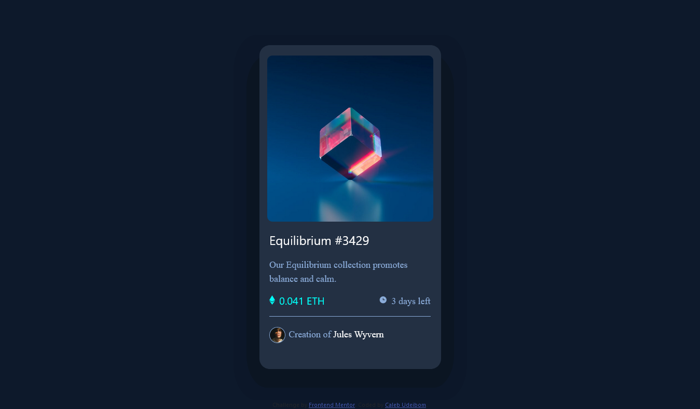
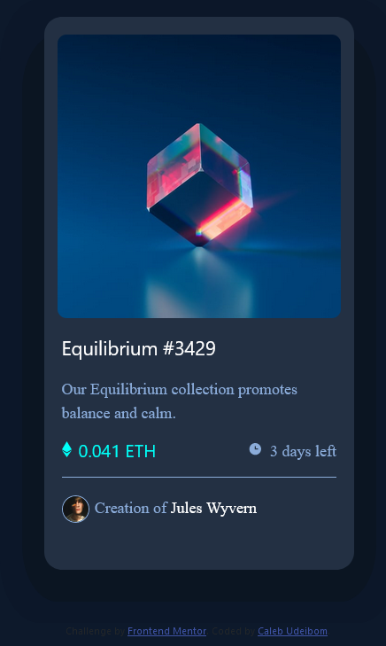

# Frontend Mentor - NFT preview card component solution

This is a solution to the [NFT preview card component challenge on Frontend Mentor](https://www.frontendmentor.io/challenges/nft-preview-card-component-SbdUL_w0U). 

## Table of contents

  - [The challenge](#the-challenge)
  - [Screenshot](#screenshot)
  - [Links](#links)
- [My process](#my-process)
  - [Built with](#built-with)
  - [What I learned](#what-i-learned)
  - [Continued development](#continued-development)
  - [Useful resources](#useful-resources)
- [Author](#author)
- [Acknowledgments](#acknowledgments)

### The challenge

Users should be able to:

- View the optimal layout depending on their device's screen size
- See hover states for interactive elements

### Screenshot




### Links

- Solution URL: [Add solution URL here](https://your-solution-url.com)
- Live Site URL: [Add live site URL here](https://caleb-nftcard.netlify.app)

## My process
- First I wrote out the complete web page using HTML.
- Then I styled it with CSS

### Built with

- Semantic HTML5 markup
- CSS custom properties
- Flexbox
- BOOTSTRAP
- Mobile-first workflow

### What I learned

-My major challenge was adding an overlay to the equilibrium image and also make the view icon visible.
-I was able to learn how to do it and now I can say I'm perfect with that.

```html
<h1>Some HTML code I'm proud of</h1>
<div class="contant">
  
  <div class="overlay">
    <div>
      
    </div>
  </div>
</div>
```
```css
.proud-of-this-css {
  .overlay {
  position: absolute;
  bottom: 0;
  left: 0;
  right: 0;
  background-color: hsl(178, 100%, 50%);
  opacity: 0.5;
  overflow: hidden;
  width: 20rem;
  height: 0;
  border-radius: 10px;
  transition: .5s ease;
}
.contant:hover .overlay {
  height: 100%;
  cursor: pointer;
}
}
```

### Continued development

I want to work more on my ability to use css colors and google fonts.

### Useful resources

- [1](https://www.w3schools.com/howto/howto_css_image_overlay_slide.asp) - This showed me how to add overlay on an image. I really liked this pattern and will use it going forward.


## Author

- Website - [Caleb Udeibom](https://www.merez.com)
- Frontend Mentor - [@Udeibom](https://www.frontendmentor.io/profile/Udeibom)
- Twitter - [@CChimmeremeze](https://www.twitter.com/CChimmeremeze)

## Acknowledgments

I want to thank Blockchain UNN for always pushing me on and encouraging me.
